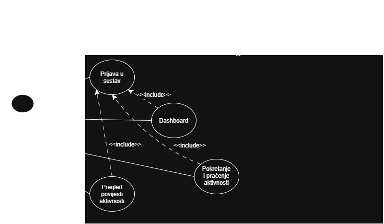

# Activity Tracker - Web Aplikacija

### Sastav tima
* **Josip Vukić** - Samostalni rad

### Opće informacije
* **Fakultet:** [Tehnički fakultet u Puli](https://unipu.hr)
* **Kolegij:** [Programsko inženjerstvo](https://unipu.hr)
* **Mentor:** [doc. dr. sc. Nikola Tanković](https://unipu.hr)

### Kratki opis projekta
Primarni cilj ove web aplikacije je omogućiti korisnicima jednostavno i uspješno praćenje, bilježenje te pregledavanje vlastitih tjelesnih aktivnosti, s fokusom na hodanje i vožnju bicikla. Sustav je razvijen kao Single Page Application (SPA) koristeći Vue.js framework i komponente, što omogućuje intuitivno sučelje i fluidan rad na računalu (desktop verzija).

### Funkcionalnosti
1. **Autentifikacija korisnika:** Prijava i registracija e-mail adresom i lozinkom.
2. **Nadzorna ploča (Dashboard):** Prikaz tjedne statistike i brzi pregled profila prijavljenog korisnika u bočnom izborniku.
3. **Praćenje aktivnosti (Live tracking):** Integracija karte s ucrtanom rutom kretanja, prikazom trenutnog vremena, udaljenosti i prosječne brzine.
4. **Povijest i statistika:** Kronološki pregled svih odrađenih treninga s naprednim detaljima ovisno o vrsti sporta (broj koraka za hodanje, tip bicikla za vožnju).

### Dokumentacija i Dijagrami

#### 1. Prototip (UI/UX)
* [Link na javni Figma prototip](https://www.figma.com/design/GOCRgjCGAhHKaC9rhVGf42/Untitled?node-id=0-1&t=brxFgrUuW0tcRjWF-1)

#### 2. Use Case Dijagram

#### 3. Class Dijagram
.png)

### Zaduženja (Plan rada)
* **Josip Vukić:** Izrada kompletnog UI/UX dizajna desktop aplikacije u Figmi, izrada tehničkih dijagrama (Use Case, Class) i kompletno programiranje frontend logike i simulacije rute u Vue.js-u.
